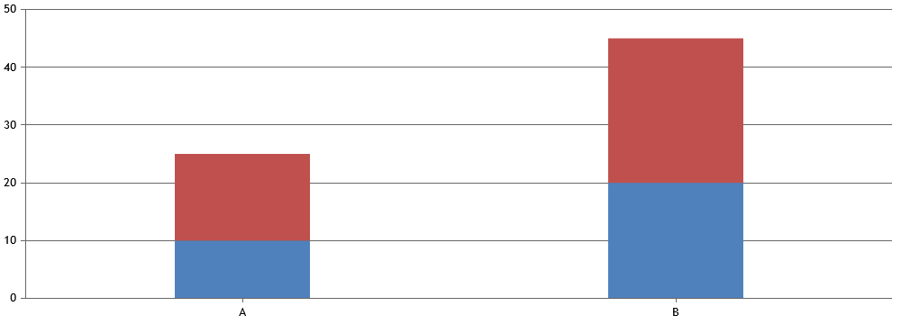

# CanvasJS Stacked Charts
### Supported Stacked Chart Types

| Chart Type          | `type` Value       |
| ------------------- |:------------------:|
| Stacked Column      | "stackedColumn"    |
| Stacked Bar         | "stackedBar"       |
| Stacked Area        | "stackedArea"      |
| Stacked Column 100% | "stackedColumn100" |
| Stacked Bar 100%    | "stackedBar100"    |
| Stacked Area 100%   | "stackedArea100"   |

### Stacked column or bar charts:
```
data: [{
    type: "stackedColumn",
    name: "Series 1",
    dataPoints: [{ label: "A", y: 10 }, { label: "B", y: 20 }]
}, {
    type: "stackedColumn",
    name: "Series 2",
    dataPoints: [{ label: "A", y: 15 }, { label: "B", y: 25 }]
}]
```


### Percentage Stacked Charts
Show data as percentages in stacked charts:
```
data: [{
    type: "stackedColumn100",
    name: "Series 1",
    dataPoints: [{ label: "A", y: 10 }, { label: "B", y: 20 }]
}, {
    type: "stackedColumn100",
    name: "Series 2",
    dataPoints: [{ label: "A", y: 15 }, { label: "B", y: 25 }]
}]
```
